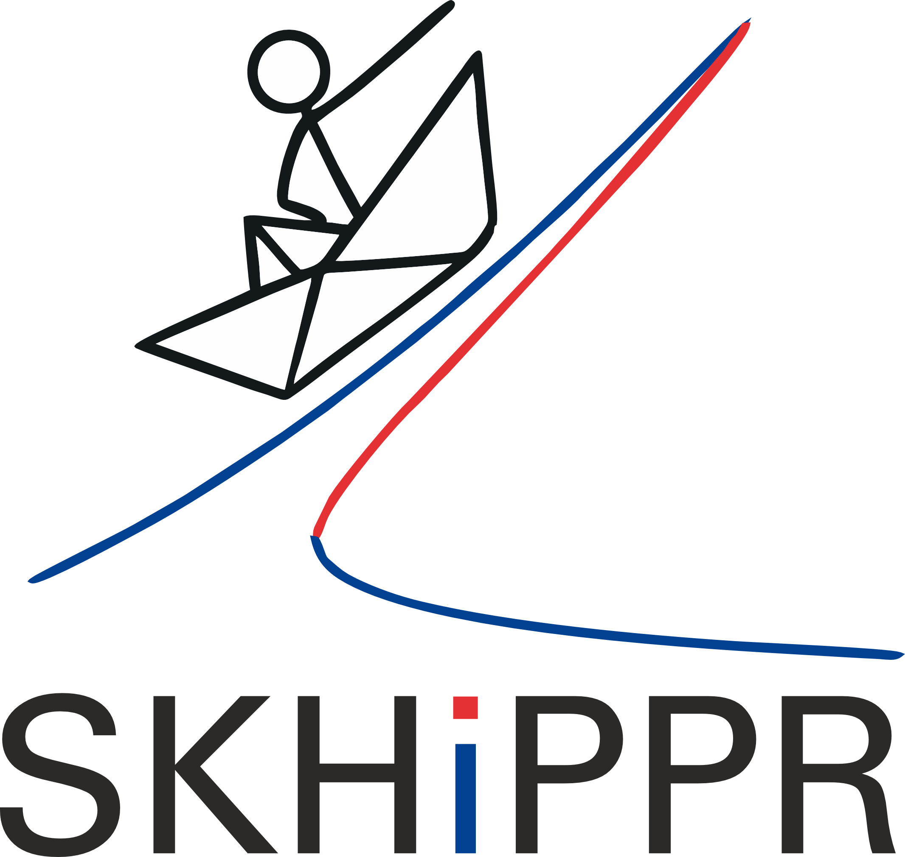

.. SKHiPPR documentation master file, created by
   sphinx-quickstart on Fri Jun 13 09:22:09 2025.
   You can adapt this file completely to your liking, but it should at least
   contain the root `toctree` directive.

SKHiPPR documentation
=====================

      

`SKHiPPR <https://github.com/f-bayer/SKHiPPR>`_ (/ˈski-pr/) is a Python toolbox with focus on **S**\ tability using the **K**\ oopman-\ **Hi**\ ll **P**\ rojection method for **P**\ eriodic solutions and **R**\ esonance curves.

   

.. 

   `SKHiPPR <https://github.com/f-bayer/SKHiPPR>`_ is a continuation toolbox developed by Fabia Bayer as part of a research project in close cooperation with Remco Leine at the Institute for Nonlinear Mechanics, University of Stuttgart, Germany. The main focus of the project is the Koopman-based Hill stability method for periodic solutions.

   For more information about the Koopman-Hill projection method, please see the following references:

   * Bayer and Leine (2023): *Sorting-free Hill-based stability analysis of periodic solutions through Koopman analysis*. Nonlinear Dyn 111, 8439–8466, https://doi.org/10.1007/s11071-023-08247-7.
   * Bayer et al. (2024): *Koopman-Hill Stability Computation of Periodic Orbits in Polynomial Dynamical Systems Using a Real-Valued Quadratic Harmonic Balance Formulation*. International Journal of Non-Linear Mechanics, 167, 104894, https://doi.org/10.1016/j.ijnonlinmec.2024.104894.
   * Bayer and Leine (2025, preprint): *Explicit error bounds and guaranteed convergence of the Koopman-Hill projection stability method for linear time-periodic dynamics*, https://arxiv.org/abs/2503.21318 
   * Project website: https://www.inm.uni-stuttgart.de/research_nonlinear_mechanics/project_bayer/

This toolbox is object-oriented and modularized. It can generate continuation curves along arbitrary (differentiable)  systems of algebraic equations and also branches of periodic solutions with stability information. This requires the following workflow: 

#. The user provides a first-order ordinary differential equation as a concrete subclass of :py:class:`~skhippr.odes.AbstractODE.AbstractODE`.
#. Using the ODE, a :py:class:`~skhippr.Fourier.Fourier` object for configuration of the FFT, and optionally a :py:class:`~skhippr.stability.AbstractStabilityHBM.AbstractStabilityHBM` object, a :py:class:`~skhippr.cycles.hbm.HBMSystem` object is instantiated to encode the harmonic balance problem.
#. A :py:class:`~skhippr.problems.newton.NewtonSolver` (or subclasses) instance can solve the :py:class:`~skhippr.cycles.hbm.HBMSystem` immediately and determine stability.
#. The :py:func:`~skhippr.problems.continuation.pseudo_arclength_continuator` iterates through a solution branch along a specified continuation parameter.

The main purpose of SKHiPPR is to provide a framework for comparing various stability analysis methods for periodic solutions and resonance curves in dynamical systems based on the Harmonic Balance method. For stability determination based on the Hill matrix (Jacobian of the HBM problem), the following classes are available and can be used interchangeably: 

* :py:class:`~skhippr.stability.KoopmanHillProjection.KoopmanHillProjection` (direct Koopman-Hill projection method, cf. Bayer and Leine (2023))
* :py:class:`~skhippr.stability.KoopmanHillProjection.KoopmanHillSubharmonic` (Koopman-Hill projection with subharmonics, cf. Bayer and Leine (2025))
* :py:class:`~skhippr.stability.ClassicalHill.ClassicalHill` (Classical Hill eigenvalue problem with either imaginary-part-based sorting, cf. Colaïtis and Batailly (2022), https://doi.org/10.1016/j.jsv.2022.117219, or symmetry-based sorting, cf. Guillot et al. (2020), https://doi.org/10.1016/j.ijnonlinmec.2024.104894)
* :py:class:`~skhippr.stability.SinglePass.SinglePassRK` (numerical integration using single-pass fixed-step explicit Runge-Kutta methods, cf. Peletan et al. (2013), https://doi.org/10.1007/s11071-012-0744-0)

The modular framework enables easy addition of new problem formulations and comparison of stability methods.

To install SKHiPPR locally on your machine, take a look at the :doc:`installation guide <installation>`. To get started, check out the :doc:`examples` or the :doc:`api` section. 

.. A :doc:`full API reference <modules>` is also available, but not recommended for getting started.

Contents
------------
.. toctree::
   :maxdepth: 2

   installation
   examples
   api
   legal_notice

